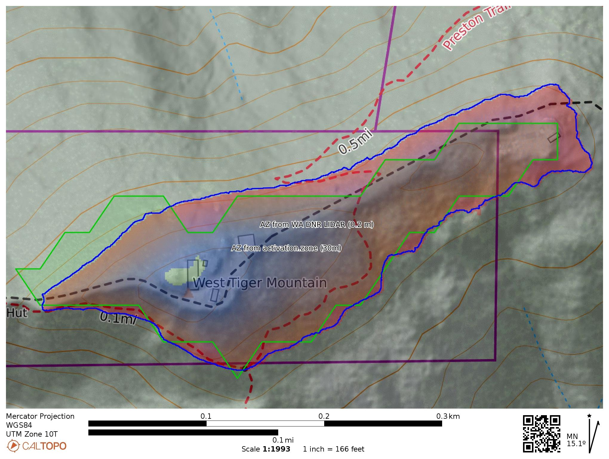

<!-- README.md is generated from README.Rmd. Please edit that file -->

```{r, include = FALSE}
knitr::opts_chunk$set(
  collapse = TRUE,
  comment = "#>",
  message = FALSE,
  warning = FALSE,
  dpi=600,
  fig.width=7)
```

# Computing Activation Zone Boundaries for [SOTA](https://www.sota.org.uk/) Summits in W7W-KG 

<!-- badges: start -->

[](https://mybinder.org/v2/gh/benmarwick/computing-sota-az-boundaries/master?urlpath=rstudio)

<!-- badges: end -->

Specifically for the KG region, we use the Digital Terrain Models (DTMs) from these four datasets: East Cascades South 2020, East Cascades North 2020, King County East 2021, King County East 2021. Spatial resolution of these datasets is about 0.2 m. 


### Prepare the summit locations and bounding boxes

Let's load the libraries we'll need

```{r}
library(raster)
library(terra)
library(tidyterra)
library(ggplot2)
library(sf)
library(tidyverse)
library(ggrepel)
library(ggspatial)
library(httr2)
```

Import a GeoJSON file containing the locations and elevations of SOTA summits. I got this file from <https://sotl.as/summits/W7W/KG>.

```{r}
# get all summits via the GeoJSON download
gjsf <- st_read("input/W7W_KG.geojson", quiet = TRUE)
```

Compare with the number of summits on sotadata via their API

```{r}
# get all summits via the SOTA API

this_region <- "KG"

library(rvest)
gjsf_api <-  httr::GET(paste0("https://api2.sota.org.uk/api/regions/W7W/",
                          this_region)) %>% 
            httr::content(., as = "text")%>% 
            jsonlite::fromJSON() %>% 
            purrr::pluck("summits") %>% 
            tibble() %>% 
  st_as_sf(coords =  c("gridRef1",
                       "gridRef2"),
           crs = st_crs(4326))

this_dir <- here::here(paste0("W7W_", this_region))

setdiff(gjsf$summitCode,
        gjsf_api$summitCode)


```


Extract the location coordinates into columns so we can use them later, and create a column for elevation in meters because our raster data is in meters.

```{r}
# make sf data frame and get coords into cols we can use
gjsf_elev <- 
gjsf %>% 
  mutate(elev_m = parse_number(str_extract(title, ",\\s*(.*?)\\s*m")),
         elev_ft = elev_m * 3.2808399) %>% 
  mutate(x = st_coordinates(geometry)[,"X"],
         y = st_coordinates(geometry)[,"Y"])
```

Create a square buffer area around each summit, with the summit in the center. This is the area that we will download a raster of elevation data to compute the activation zone. This area is good enough for most summits, but for a few summits with very large activation zones it's too small, we must increase the buffer side length to ensure we capture the full area of the activation zone. I did this manually for the small number of summits that needed it. 

```{r}
# make a single square buffer for each point
# Function to create the square buffers
# https://stackoverflow.com/a/70372149/1036500
bSquare <- function(x, a) {
  a <- sqrt(a)/2
  return( sf::st_buffer(x, dist = a, nQuadSegs=1, 
                        endCapStyle = "SQUARE") )
}

# get a buffer zone of a certain area
buffer_side_length <- 1e6 # 100 is a 10x10, this is the value we manually adjust to manage buffer area, up to 4e7 to get the biggest AZ
gjsf_elev_buf <- 
bSquare(gjsf_elev, buffer_side_length)

gjsf_elev_buf_sq <- vector("list", nrow(gjsf_elev_buf))
for(i in 1:nrow(gjsf_elev_buf)){
  gjsf_elev_buf_sq[[i]] <- 
    st_bbox(gjsf_elev_buf[i,]) %>%
    st_as_sfc() %>%
    st_as_sf()
}

gjsf_elev_buf_sq_df <- 
  bind_rows(gjsf_elev_buf_sq)
```

Take a look at the buffer zones and summit points altogether

```{r}
ggplot() + 
  geom_sf(data = gjsf_elev_buf_sq_df,
          colour = "red", fill = NA) +
  geom_sf(data = gjsf,
          size = 0.1) +
  coord_sf() +
  annotation_scale(location = "bl", 
                   width_hint = 0.5) +
  theme_minimal()
```

Convert the buffer zone into a list of bounding box coordinates to input into the raster download function

```{r}
# get list of bounding boxes coords
gjsf_elev_buf_sq_bbx <- vector("list", nrow(gjsf_elev_buf_sq_df))
for(i in 1:nrow(gjsf_elev_buf_sq_df)){
  gjsf_elev_buf_sq_bbx[[i]] <- 
    gjsf_elev_buf_sq_df$x[i] %>% 
    st_coordinates() %>% 
    as.data.frame() %>% 
    select(X, Y)
}
```

### Iterate over each summit to compute the activation zone polygon

Here is a loop that takes each summit and its bounding box and:

-   downloads some raster tiles to cover the bounding box area
-   then selects all the pixels in the raster that have an elevation value between the summit elevation and 25m below that elevation
-   then draw a polygon around those pixels
-   then drop polygons that don't contain the summit point, or are with 20 m of it (since a few summits are outside of their activation zone)
-   then write the polygon of the activation zone to a GeoJSON file

This chunk of code takes several hours to run and downloads raster tiles on each iteration of the loop. If you are viewing this in the [Binder](<https://mybinder.org/v2/gh/benmarwick/computing-sota-az-boundaries/master?urlpath=rstudio>) instance, you can skip this step and jump down to where we [inspect the data](#inspect-all-the-summits-and-activation-zones-in-our-set)

```{r, results='hide', eval=FALSE}
# loop over each bounding box, get the DSM raster 
# and find the AZ polygon and save as geoJSON

az_elev_m <- 25 # AZ is area -25m elevation from summit

for(i in 1:nrow(gjsf_elev)){
  
  this_summit <- gjsf_elev[i, ] 
  this_square <- gjsf_elev_buf_sq_df[i, ]
  
  print(paste0("Starting work on the AZ for ", this_summit$id,
               "..."))

# simplify bounding box coords
bbx_m <- 
  gjsf_elev_buf_sq_df[i, ] %>% 
  st_cast("POINT") %>% 
  st_coordinates()

# construct URL to query the LIDAR data portal using our bbox coords
url <- paste0("https://lidarportal.dnr.wa.gov/download?geojson=%7B%22type%22%3A%22Polygon%22%2C%22",
              "coordinates%22%3A%5B%5B%5B",
              bbx_m[1,1], "%2C", bbx_m[1,2], "%5D%2C%5B",
              bbx_m[2,1], "%2C", bbx_m[2,2], "%5D%2C%5B", 
              bbx_m[3,1], "%2C", bbx_m[3,2], "%5D%2C%5B",
              bbx_m[4,1], "%2C", bbx_m[4,2], "%5D%2C%5B",
              bbx_m[5,1], "%2C", bbx_m[5,2], "%5D%5D%5D%7D",
              "&ids=",
              "1615", "%2C",   # East Cascades South 2020 DTM (not hillshade)
              "1609", "%2C",   # East Cascades North 2020 DTM (not hillshade)
              "1501", "%2C",   # King County East 2021 DTM (not hillshade)
              "1603"           # King County East 2021 DTM (not hillshade)
                               # 
)

print(paste0("Downloading LIDAR data for ", this_summit$id,
             "..."))

# send our query to the LIDAR portal, unzip the response and import the tif file
req <- request(url)
resp <- req %>% req_perform()
v = resp_body_raw(resp)
rm(resp)
writeBin(v, "data.zip")
rm(v)
unzip("data.zip", 
      exdir = "from_url_req/")
unlink("data.zip")
the_raster_files <- 
  list.files(path = here::here("from_url_req/"),
             pattern = "*.tif",
             full.names = TRUE,
             ignore.case = TRUE,
             recursive = TRUE)

# import into our R session, mostly there are multiple tif 
# files, but sometimes just one
if(length(the_raster_files) == 1){
  m <- rast(the_raster_files)
} else {
  m <- sprc(the_raster_files)
  m <- terra::merge(m, gdal=c("BIGTIFF=YES", "NUM_THREADS = ALL_CPUS") )
}

# transform summit and bounding box coords 
# to the projection of LIDAR data
this_square_nad83 <- st_transform(this_square, st_crs(m))
this_summit_nad83 <- st_transform(this_summit, st_crs(m))

# subset LIDAR data that fills just this square
lidar_cropped <- 
  terra::crop(m, this_square_nad83)

# delete downloaded files
unlink(here::here("from_url_req/"), recursive = TRUE)

# # take a look
# ggplot() +
#   geom_spatraster(data = lidar_cropped) +
#   geom_sf(data = this_summit_nad83) +
#   geom_sf(data = this_square_nad83,
#           fill = NA) +
#   scale_fill_viridis_c(na.value = "white",
#                        name = "Elevation (ft)") +
#   annotation_scale(location = "bl",
#                    width_hint = 0.5,
#                    pad_y = unit(0.1, "cm"),
#                    pad_x = unit(0.5, "cm"),
#                    style =  "ticks") +
#   coord_sf()

# get max elevation in this area
lidar_cropped_max_elev_ft <- minmax(lidar_cropped)[2]

# define elevation contour that bounds the AZ
this_summit_point_az <- 
  this_summit_nad83 %>% 
  mutate(lidar_cropped_max_elev_ft = lidar_cropped_max_elev_ft, 
         lidar_cropped_max_elev_m = lidar_cropped_max_elev_ft / 3.2808399,
         az_lower_contour = ifelse(elev_m <= lidar_cropped_max_elev_m,
                                   elev_m - az_elev_m,         
                                   lidar_cropped_max_elev_m - az_elev_m ),  # SOTA summit data does not always match raster data
         az_lower_contour_ft = az_lower_contour * 3.2808399) 

# subset the summit point that is in this bbox
lidar_cropped[lidar_cropped < this_summit_point_az$az_lower_contour_ft] <- NA

# # take a look
# ggplot() +
#   geom_spatraster(data = lidar_cropped) +
#   geom_sf(data = this_summit_nad83) +
#   geom_sf(data = this_square_nad83,
#           fill = NA) +
#   scale_fill_viridis_c(na.value = "white",
#                        name = "Elevation (ft)") +
#   annotation_scale(location = "bl",
#                    width_hint = 0.5,
#                    pad_y = unit(0.1, "cm"),
#                    pad_x = unit(0.5, "cm"),
#                    style =  "ticks") +
#   coord_sf()

# get extent of the AZ raster as polygon
az_poly <- st_as_sf(as.polygons(lidar_cropped > -Inf))

# ggplot() +
# geom_sf(data = this_summit_nad83) +
# geom_sf(data = az_poly,
#         colour = "red",
#         fill = NA) +
# scale_fill_viridis_c(na.value = "white",
#                      name = "Elevation (ft)") +
# annotation_scale(location = "bl",
#                  width_hint = 0.5,
#                  pad_y = unit(0.1, "cm"),
#                  pad_x = unit(0.5, "cm"),
#                  style =  "ticks") +
# coord_sf()

# if there are multiple polygons, we only want the one that 
# contains the summit point when we have multipolys, 
# we just want the one with the summit in it

# dissolve all into one polygon
df_union_cast <- sf::st_union(sf::st_as_sf(az_poly))
df_union_cast <- st_cast(df_union_cast, "POLYGON")

poly_with_summit <- 
  apply(st_is_within_distance(df_union_cast, 
                              this_summit_nad83, 
                              sparse = FALSE,
                              dist = 25), 2, # within or 10 m outside of, because some 
        # summits are just outside of their
        # nearest polygon
        function(col) { 
          df_union_cast[which(col), ]
        })[[1]]

# # now we see the single polygon that is the activation zone
ggplot() +
  geom_sf(data = poly_with_summit) +
  geom_sf(data = this_summit_nad83) +
  coord_sf() +
  annotation_scale(location = "bl", 
                   width_hint = 0.5,
                   pad_y = unit(0.1, "cm"),
                   pad_x = unit(0.5, "cm"),
                   style =  "ticks") 

poly_with_summit <- st_as_sf(st_transform(poly_with_summit, st_crs(this_summit)))

print(paste0("Saving GeoJSON file for ", this_summit$id,
             "..."))

# write AZ polygon to a GeoJSON file
file_name <- paste0("output/", str_replace_all(this_summit$id, "/|-", "_"), 
                    ".geojson")

# export AZ polygon as a GeoJSON file
geojsonio::geojson_write(poly_with_summit, 
                         file = here::here(file_name),
                         quiet = TRUE)


}
```

After running the code block above we now have one GeoJSON file per summit with a polygon defining its activation zone in our `/output` directory.

### Inspect all the summits and activation zones in our set

Import the GeoJSON files and display the summit points and activation zones polygons on an interactive map. To quickly explore these data without downloading anything, and use the interactive map in your web browser, [click here to open an instance of RStudio in your browser tab](https://mybinder.org/v2/gh/benmarwick/computing-sota-az-boundaries/master?urlpath=rstudio)

```{r results='hide'}
library(tidyverse)
library(sf)

# import the GeoJSON files with the AZ polygons
gjson_files <- 
  list.files(path = "output",
             full.names = TRUE,
             recursive = TRUE)

az_files <- 
  map(gjson_files,
      st_read,
      quiet = TRUE) 

names(az_files) <- str_remove_all(basename(gjson_files), 
                                  "output|.geojson")

summit_geometry <- 
  bind_rows(az_files, .id = "summit") %>% 
  select(summit, geometry)
```

Here are all the summits in W7W/KG and their activation zones as computed above (grey polygons), the red squares are my arbitrary buffer zones that I downloaded the LIDAR data for:


```{r}
# take a look at the summits and AZs
  ggplot() +
    geom_sf(data = summit_geometry) + 
    geom_sf(data = gjsf_elev_buf_sq_df,
            colour ="red",
            fill = NA,
            size = 0.1) +
    geom_text_repel(data = gjsf_elev,
                    aes( x, y,
                         label = name),
                    bg.color = "white",
                    bg.r = 0.1,
                    size = 1.5,
                    segment.colour= "grey") +
    annotation_scale(location = "bl", 
                     width_hint = 0.5,
                     pad_y = unit(0.1, "cm"),
                     pad_x = unit(0.5, "cm"),
                    style =  "ticks") +
    coord_sf() +
    theme_minimal(base_size = 8)
```


Here's a comparison with two other methods. The green outline polygon is from https://activation.zone/?summitRef=W7W/KG-116 and the blue outline polygon is the activation zone computed using the code above. The red-blue filled polygon is the activation zone determined by the Caltopo DEM shading tool. This map with the three activation zones is also online at https://caltopo.com/m/GPM5V

```{r out.width="100%"}

```

This code block makes an interactive map of the summits and activation zones. On GitHub this shows as a static image. Here we have zoomed in on [W7W/KG-142 Union Hill](https://sotl.as/summits/W7W/KG-142) which is remarkable because it has a very large activation zone that includes an elementary school and recreational park at the north end.

```{r}
library(leaflet)

gjsf <- st_read("input/W7W_KG.geojson")

which_summit <- 
  which(summit_geometry$summit == "W7W_KG_100")

l <- 
leaflet() %>% 
  addProviderTiles("OpenStreetMap") %>% 
  addPolygons(data = summit_geometry,
              color = "red", 
              weight = 1) %>% 
  addCircleMarkers(data = gjsf %>% 
                     mutate(id = str_replace_all(id, "/|-", "_")) %>% 
                     filter(id %in% summit_geometry$summit ),
                   radius = 1,
                   weight = 1,
                   label = ~id,
                   labelOptions = labelOptions(noHide = T, 
                                               direction = "top",
                                               offset = c(0, -15))) %>% 
  setView(-122, 47.66,  zoom = 15)  %>%
  addScaleBar()


l # open the interactive map for panning and zooming over all the summits
```


```{r, eval = FALSE, echo=FALSE}
# distribution of summit AZ areas
library(units)

st_area(summit_geometry) %>% 
  tibble(area = .) %>% 
  mutate(area = as.numeric(area)) %>% 
  ggplot() +
  aes(area) %>% 
  geom_histogram() +
  scale_x_log10(labels = scales::label_comma(),
                name = "Size of activation zone (square m)")

```


### Licenses

**Text and figures :** [CC-BY-4.0](http://creativecommons.org/licenses/by/4.0/)

**Code :** see [LICENSE.md](LICENSE.md)

**Data :** [CC-0](http://creativecommons.org/publicdomain/zero/1.0/)

### Contributions

We welcome contributions from everyone. Before you get started, please see our [contributor guidelines](CONTRIBUTING.md). Please note that this project is released with a [Contributor Code of Conduct](CONDUCT.md). By participating in this project you agree to abide by its terms.
