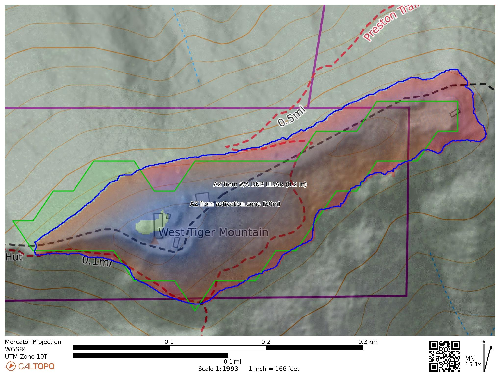

<!-- README.md is generated from README.Rmd. Please edit that file -->

```{r, include = FALSE}
knitr::opts_chunk$set(
  collapse = TRUE,
  comment = "#>",
  message = FALSE,
  warning = FALSE,
  dpi=600,
  fig.width=7)
```

# Computing Activation Zone Boundaries for [SOTA](https://www.sota.org.uk/) Summits in W7W-KG 

<!-- badges: start -->

[](https://mybinder.org/v2/gh/benmarwick/computing-sota-az-boundaries/master?urlpath=rstudio)

<!-- badges: end -->

### Background

The goal of this repository is to generate polygons that indicate the [activation zones](https://www.sota.org.uk/Blog/2017/07/08/In-The-Zone) for [SOTA](https://www.sota.org.uk/) summits in the W7W-KG area. Here is how the [SOTA FAQ](https://www.sota.org.uk/Joining-In/FAQs) defines the activation zone:

> Q. What is the Activation Zone?

> A. Often it is inconvenient to operate from the actual highest point of a summit, there may be structures there, or on a frequently visited summit there may be too many people about. The SOTA rules permit the operating position to be away from the summit but not more than 25 vertical metres below the summit. If you draw a contour line on a map 25 metres below the summit, the area within this contour is the Activation Zone. See this [MT blog posting](https://www.sota.org.uk/Blog/2017/07/08/In-The-Zone) for more information. If you operate from outside the AZ, the activation is not valid and will score no points.

Prior work on computing activation zones includes: 

- the web app https://activation.zone/ by [Ara N6ARA](https://n6ara.com/) which uses 30m elevation data provided by the [elevation Python package](https://pypi.org/project/elevation/). 
- On [sotl.as](https://sotl.as/) activation zones are visible in the map view for HB/HB0 (calculated using [swissALTI3D](https://www.swisstopo.admin.ch/de/hoehenmodell-swissalti3d) data from swisstopo (spatial resolution 0.5 m, accuracy ± 0.3 – 3 m (1σ) depending on the region) and OE (calculated using BEV ALS DTM data (spatial resolution 1 m, accuracy generally ± 0.5 m, may vary in high altitude). The OE activation zones were computed by [Tobi OE7TOK](https://reflector.sota.org.uk/t/activation-zones-for-oe-on-sotlas/34629). 
- [Caltopo](https://caltopo.com/) can also be used to compute activation zones using the DEM shading tool on a desktop computer or smartphone (see [Tim N7KOM's](https://www.etsy.com/shop/N7KOMPortableRadio) [tutorial](https://www.youtube.com/watch?v=UixA1Fc4D1c) on how to do this). CalTopo's elevation data is up to 1 meter resolution in many areas, which is based on LIDAR scans from the USGS's 3DEP program. This is currently the highest resolution freely available tool for on-the-fly computation of activation zone areas.  

The goal of these project is generate activation zone polygons as GeoJSON files that can be integrated into the sotl.as map. This is inspired by the work done for HB/HB0 and OE, where operators can view the activation zone polygon directly in the sotl.as map  Currently this project only does summits in the W7W-KG area. Here I use the R programming language to access the API for [Amazon Web Services (AWS) Terrain Tiles](https://registry.opendata.aws/terrain-tiles/) to download a small raster file of elevation data for each summit, and compute the activation zone polygon and save it to a GeoJSON file. Higher resolution rasters are available at https://lidarportal.dnr.wa.gov/, but currently there is no API for these. 

### Acquire the data

Let's load the libraries we'll need

```{r}
library(raster)
library(terra)
library(tidyterra)
library(ggplot2)
library(sf)
library(tidyverse)
library(ggrepel)
library(ggspatial)
```

Import a GeoJSON file containing the locations and elevations of SOTA summits. I got this file from <https://sotl.as/summits/W7W/KG>.

```{r}
# get all summits via the GeoJSON download
gjsf <- st_read("input/W7W_KG.geojson")
```

Extract the location coordinates into columns so we can use them later, and create a column for elevation in meters because our raster data is in meters.

```{r}
# make sf data frame and get coords into cols we can use
gjsf_elev <- 
gjsf %>% 
  mutate(elev_m = parse_number(str_extract(title, ",\\s*(.*?)\\s*m")),
         elev_ft = elev_m * 3.2808399) %>% 
  mutate(x = st_coordinates(geometry)[,"X"],
         y = st_coordinates(geometry)[,"Y"])
```

Create a square buffer area of 1000m by 1000m around each summit, with the summit in the center. This is the area that we will download a raster of elevation data to compute the activation zone. This area is good enough for most summits, but for a few summits with very large activation zones it's too small, we'll deal with that later.

```{r}
# make a single square buffer for each point
# Function to create the square buffers
# https://stackoverflow.com/a/70372149/1036500
bSquare <- function(x, a) {
  a <- sqrt(a)/2
  return( sf::st_buffer(x, dist = a, nQuadSegs=1, 
                        endCapStyle = "SQUARE") )
}

# get a buffer zone of a certain area
buffer_side_length <- 1e6 # 100 is a 10x10
gjsf_elev_buf <- 
bSquare(gjsf_elev, buffer_side_length)

gjsf_elev_buf_sq <- vector("list", nrow(gjsf_elev_buf))
for(i in 1:nrow(gjsf_elev_buf)){
  gjsf_elev_buf_sq[[i]] <- 
    st_bbox(gjsf_elev_buf[i,]) %>%
    st_as_sfc() %>%
    st_as_sf()
}

gjsf_elev_buf_sq_df <- 
  bind_rows(gjsf_elev_buf_sq)
```

Take a look at the buffer zones and summit points altogether

```{r}
ggplot() + 
  geom_sf(data = gjsf_elev_buf_sq_df,
          colour = "red", fill = NA) +
  geom_sf(data = gjsf,
          size = 0.1) +
  coord_sf() +
  annotation_scale(location = "bl", 
                   width_hint = 0.5) +
  theme_minimal()
```

Convert the buffer zone into a list of bounding box coordinates to input into the raster download function

```{r}
# get list of bounding boxes coords
gjsf_elev_buf_sq_bbx <- vector("list", nrow(gjsf_elev_buf_sq_df))
for(i in 1:nrow(gjsf_elev_buf_sq_df)){
  gjsf_elev_buf_sq_bbx[[i]] <- 
    gjsf_elev_buf_sq_df$x[i] %>% 
    st_coordinates() %>% 
    as.data.frame() %>% 
    select(X, Y)
}
```

### Iterate over each summit to compute the activation zone polygon

Here is a loop that takes each summit and its bounding box and:

-   downloads some raster tiles to cover the bounding box area
-   then selects all the pixels in the raster that have an elevation value between the summit elevation and 25m below that elevation
-   then draw a polygon around those pixels
-   then drop polygons that don't contain the summit point
-   then check if the activation zone polygon has the same dimension as the buffer zone, if it does, make the buffer zone much bigger and repeat the steps above to properly handle summits with unusually large activation zones
-   then write the polygon of the activation zone to a GeoJSON file


This chunk of code takes several minutes to run and downloads raster tiles on each iteration of the loop. If you are viewing this in the [Binder](<https://mybinder.org/v2/gh/benmarwick/computing-sota-az-boundaries/master?urlpath=rstudio>) instance, you can skip this step and jump down to where we [inspect the data](#inspect-all-the-summits-and-activation-zones-in-our-set)

```{r, results='hide', cache=TRUE}
# loop over each bounding box, get the DSM raster 
# and find the AZ polygon and save as geoJSON

# create a list to store some output from this loop
loop_output <- vector("list", nrow(gjsf_elev))
loop_output$this_summit_point <- NULL
loop_output$bbx_ras <- NULL
loop_output$this_summit_point_az <- NULL
loop_output$poly_with_summit <- NULL

#----------------------------------
for(i in 1:nrow(gjsf_elev)){
  
this_summit_point <- gjsf_elev[i, ]

loop_output$this_summit_point[[i]] <- this_summit_point
  
print(paste0("Starting work on the AZ for ", this_summit_point$id,
               "..."))
  
# extract the bounding box for just this summit
bbx_st_poly <- gjsf_elev_buf_sq_df[i, ]

# simplify bounding box coords
bbx_m <- 
bbx_st_poly %>% 
  st_cast("POINT") %>% 
  st_coordinates() 

# construct URL to query the LIDAR data portal using our bbox coords
url <- paste0("https://lidarportal.dnr.wa.gov/download?geojson=%7B%22type%22%3A%22Polygon%22%2C%22",
              "coordinates%22%3A%5B%5B%5B",
              bbx_m[1,1], "%2C", bbx_m[1,2], "%5D%2C%5B",
              bbx_m[2,1], "%2C", bbx_m[2,2], "%5D%2C%5B", 
              bbx_m[3,1], "%2C", bbx_m[3,2], "%5D%2C%5B",
              bbx_m[4,1], "%2C", bbx_m[4,2], "%5D%2C%5B",
              bbx_m[5,1], "%2C", bbx_m[5,2], "%5D%5D%5D%7D",
              "&ids=1603")

# King County East 2021 is 1603
# King 2003 is 547 
# East Cascades South 2020 is 1615
# but different resolutions?

# send our query to the LIDAR portal, unzip the response and import the tif file
library(httr2)
req <- request(url)
# the next step takes a few moments to download
resp <- req %>% req_perform()
v = resp_body_raw(resp)
writeBin(v, "data.zip")
unzip("data.zip", exdir = "from_url_req/")
the_raster_file <- 
  list.files(path = here::here("from_url_req/"),
             pattern = "*.tif",
             full.names = TRUE,
             ignore.case = TRUE,
             recursive = TRUE)
# import into our R session
# if we get multiple files, we need to merge them
s <- sprc(the_raster_file)
m <- merge(s)
# delete the raster files now that we've imported them
unlink(the_raster_file, recursive = TRUE)

# re-project to WGS84 and crop to bbox, this takes a few moments
# but saves time in later steps
m_reprojected <-  project(m, crs(bbx_st_poly))
bbx_ras_reprojected_cropped <- terra::crop(m_reprojected, bbx_st_poly)

# store it for later
loop_output$bbx_ras[[i]] <- bbx_ras_reprojected_cropped

# Create a function to process the elevation raster to get the AZ polygon
# we make a function so we can re-use it later
get_az_polygon_fn <- function(bbx_ras = bbx_ras){

# get max elev from raster
bbx_ras_max_m <- minmax(bbx_ras)[2] / 3.2808399

# find area that is in AZ in meters. If the SOTA summit elev is 
# greater than the max elev in the raster, this is an error, so
# let's handle it. e.g. elevation for Boise Ridge W7W/KG-114 
# might be wrong: max in raster is 941m, but SOTA data is 969m

az_elev <- 20 # AZ is area -25m elevation from summit, 
              # we take a conservative approach here to 
              # compensate for the raster resolution, gps error, etc.

# define elevation contour that bounds the AZ
this_summit_point_az <- 
    this_summit_point %>% 
    mutate(bbx_ras_max_m = bbx_ras_max_m, # this is helpful for debugging
           az_lower_contour = ifelse(elev_m <= bbx_ras_max_m,
                                     elev_m - az_elev,         
                                     bbx_ras_max_m - az_elev ),  # SOTA summit data does not always match raster data
           az_lower_contour_ft = az_lower_contour * 3.2808399)  

# subset the summit point that is in this bbox
rast <- bbx_ras
rast[rast < this_summit_point_az$az_lower_contour] <- NA
  
# get extent of the AZ raster as polygon
az_poly <- st_as_sf(as.polygons(rast > -Inf))

# dissolve all into one polygon
df_union_cast <- sf::st_union(sf::st_as_sf(az_poly))
df_union_cast <- st_cast(df_union_cast, "POLYGON")

# if there are multiple polygons, we only want the one that 
# contains the summit point when we have multipolys, 
# we just want the one with the summit in it
  
poly_with_summit <- 
    apply(st_is_within_distance(df_union_cast, 
                        this_summit_point, 
                        sparse = FALSE,
                        dist = 10), 2, # within or 10 m outside of, because some 
                                       # summits are just outside of their
                                       # nearest polygon
          function(col) { 
            df_union_cast[which(col), ]
          })[[1]]

  # what is the longest linear dimension of this AZ polygon?
  # if it's the same as the bbox dimensions, then our bbox is 
  # probably too small and we need to get a bigger one
  poly_with_summit_max_linear_dim <- 
  poly_with_summit %>% 
        st_cast('MULTIPOINT') %>% 
        st_cast('POINT') %>% 
        st_distance %>% 
        max()
  
  return(list(this_summit_point_az = this_summit_point_az,
              poly_with_summit = poly_with_summit,
              poly_with_summit_max_linear_dim = poly_with_summit_max_linear_dim))
  
}

# run the function
output <- get_az_polygon_fn(bbx_ras = bbx_ras)

# collect some output
loop_output$this_summit_point_az[[i]] <- output$this_summit_point_az
loop_output$poly_with_summit[[i]] <- output$poly_with_summit
  
  class(output$poly_with_summit_max_linear_dim) <- "numeric"
  
# check if we got the entire AZ or we need to compute on a larger raster
  if(output$poly_with_summit_max_linear_dim < sqrt(buffer_side_length)) {
    
    print(paste0("OK: the max linear dimenstion of the AZ computed for ",
                 this_summit_point$id,
                 " is smaller than our bounding box"))
    
    print(paste0("The AZ for ", this_summit_point$id,
                 " was successfully computed"))
  } else {
     
    print(paste0("Not OK: the max linear dimenstion of the AZ computed for ",
                 this_summit_point$id,
                 " is bigger than our bounding box. Trying a bigger bounding box..."))
    
    bbx_st_poly_enlarged <- 
      bSquare(bbx_st_poly, 
              buffer_side_length * 100)
    
    bbx_ras_enlarged =
      elevatr::get_elev_raster(bbx_st_poly_enlarged %>% 
                                 st_cast("POINT"), 
                               src = "aws",
                               clip = "bbox", 
                               verbose = TRUE, 
                               # resolution info is here 
                               # https://github.com/tilezen/joerd/blob/master/docs/data-sources.md#what-is-the-ground-resolution
                               # around 5 m / pixel at z = 14 ?
                               z = 14, # this is the max possible
                               prj =  "WGS84")
    
    # run the custom function to get the AZ polygon using this
    # much enlarged area of raster elevation 
    output <- get_az_polygon_fn(bbx_ras = bbx_ras_enlarged)
    
    # collect some output
loop_output$this_summit_point_az[[i]] <- output$this_summit_point_az
loop_output$poly_with_summit[[i]] <- output$poly_with_summit
    
    print(paste0("Finished trying a bigger bounding box for ",
                 this_summit_point$id))
  }
  
# write AZ polygon to a GeoJSON file
file_name <- paste0("output/", str_replace_all(this_summit_point$id, "/|-", "_"), 
                    ".geojson")

# export AZ polygon as a GeoJSON file
geojsonio::geojson_write(output$poly_with_summit, 
                         file = here::here(file_name),
                         quiet = TRUE)
}
```

After running the code block above we now have one GeoJSON file per summit with a polygon defining its activation zone in our `/output` directory.

Here are all the summits in W7W/KG (red points) and their activation zones as computed above (grey polygons):

```{r}
this_summit_point_df <- bind_rows(loop_output$this_summit_point) # 160 
this_summit_point_az_df <- bind_rows(loop_output$this_summit_point_az) # 160
poly_with_summit_df <- bind_rows(loop_output$poly_with_summit) %>% select(geometry) # 160

# take a look at the summits and AZs
  ggplot() +
    geom_sf(data = poly_with_summit_df) + 
    geom_sf(data = this_summit_point_df,
            colour ="red",
            fill = NA,
            size = 0.1) +
    geom_text_repel(data = this_summit_point_df,
                    aes( x, y,
                         label = name),
                    bg.color = "white",
                    bg.r = 0.1,
                    size = 1.5,
                    segment.colour= "grey") +
    annotation_scale(location = "bl", 
                     width_hint = 0.5,
                     pad_y = unit(0.1, "cm"),
                     pad_x = unit(0.5, "cm"),
                    style =  "ticks") +
    coord_sf() +
    theme_minimal(base_size = 8)
```

Here is a close-up look at one summit and the activation zone we have computed for it:

```{r}
# take a look at a summit and AZ
i <- which(str_detect(this_summit_point_df$name, "Tiger"))[2]

ggplot() +
    geom_spatraster(data = rast(loop_output$bbx_ras[[i]])) +
    geom_sf(data = poly_with_summit_df[i,],
            colour ="red",
            fill = NA) +
    geom_point(data = this_summit_point_az_df[i,],
               aes(x, y)) + 
    geom_text_repel(data = this_summit_point_az_df[i,],
                    aes( x, y,
                         label = name),
                    bg.color = "white",
                    bg.r = 0.1) +
    scale_fill_viridis_c(na.value = "white",
                         name = "Elevation (m)") +
    annotation_scale(location = "bl", 
                     width_hint = 0.5,
                     pad_y = unit(0.1, "cm"),
                     pad_x = unit(0.5, "cm"),
                    style =  "ticks") +
    coord_sf() +
    theme_minimal(base_size = 8)
```


```{r echo=FALSE, eval=FALSE}

# make a sf polygon from the WKT output from https://activation.zone/?summitRef=W7W/KG-116
# so we can upload it to caltopo as a layer

d <- data.frame(a = 1)
d$geom <- "POLYGON((-121.97143333333332 47.504988888888874,-121.97143333333332 47.50471111111111,-121.9717111111111 47.50471111111111,-121.97198888888889 47.50443333333334,-121.97226666666667 47.50443333333334,-121.97254444444444 47.50443333333334,-121.97282222222222 47.50415555555554,-121.9731 47.50415555555554,-121.97337777777778 47.503877777777774,-121.97365555555557 47.503600000000006,-121.97393333333335 47.503600000000006,-121.97421111111113 47.50332222222221,-121.97448888888889 47.50332222222221,-121.97476666666667 47.50332222222221,-121.97504444444445 47.50304444444444,-121.9753222222222 47.50332222222221,-121.97559999999999 47.50332222222221,-121.97587777777777 47.50332222222221,-121.97615555555555 47.503600000000006,-121.97643333333333 47.503600000000006,-121.97671111111111 47.503600000000006,-121.97698888888888 47.503600000000006,-121.97726666666667 47.503600000000006,-121.97754444444445 47.503877777777774,-121.97726666666667 47.503877777777774,-121.97698888888888 47.50415555555554,-121.97671111111111 47.50415555555554,-121.97643333333333 47.50443333333334,-121.97615555555555 47.50443333333334,-121.97587777777777 47.50443333333334,-121.97559999999999 47.50415555555554,-121.9753222222222 47.50415555555554,-121.97504444444445 47.50443333333334,-121.97476666666667 47.50443333333334,-121.97448888888889 47.50443333333334,-121.97421111111113 47.50443333333334,-121.97393333333335 47.50443333333334,-121.97365555555557 47.50443333333334,-121.97337777777778 47.50471111111111,-121.9731 47.50471111111111,-121.97282222222222 47.50471111111111,-121.97254444444444 47.504988888888874,-121.97226666666667 47.504988888888874,-121.97198888888889 47.504988888888874,-121.9717111111111 47.504988888888874,-121.97143333333332 47.504988888888874))"

d_sf <- st_as_sf(d, 
                 wkt = "geom",
                 crs = st_crs(poly_with_summit_df))

geojsonio::geojson_write(d_sf, file = "west-tiger-mounain-activation.zone.geojson")

# I uploaded this to caltopo

```


Here's a comparison with two other methods. The green polygon is from https://activation.zone/?summitRef=W7W/KG-116 and the yellow polygon is the activation zone computed using the code above. The red-blue polygon is the activation zone determined by the Caltopo DEM shading tool. This map with the three activation zones is also online at https://caltopo.com/m/GPM5V

```{r out.width="100%"}

```


<!-- 

### Differences between summit elevation values in the SOTA data and in the [Amazon Web Services (AWS) Terrain Tiles](https://registry.opendata.aws/terrain-tiles/).

In developing this analysis I found that some summits have elevation values recorded in the SOTA data that are different from the elevation data in the Terrain Tiles. The differences in elevation of summits mean that some activation zones calculated here might not be accurate. In the plot below, the upper panel shows the full range of summits where the SOTA elevation differs from the Terrain Tiles, and the lower panel is a zoomed in view at -25m, 25m. The labelled summits, especially those in the top panel that deviate more than 20m, are ones where the activation zones computed here may be slightly inaccurate.

```{r}
library(ggforce)

this_summit_point_az_df_outliers1 <- 
this_summit_point_az_df %>% 
  mutate(diff_elev = bbx_ras_max - elev_m) %>% 
  filter(  diff_elev >= 20 | diff_elev <= -20 )

this_summit_point_az_df_outliers2 <- 
this_summit_point_az_df %>% 
  mutate(diff_elev = bbx_ras_max - elev_m) %>% 
  filter(  diff_elev >= 5 | diff_elev <= -5 ) %>% 
  filter(between(  diff_elev, -25, 25))

p1 <- 
this_summit_point_az_df %>% 
  mutate(diff_elev = bbx_ras_max - elev_m) %>% 
ggplot() +
  aes(diff_elev) +
  geom_histogram(bins = 100)  +
  theme_minimal() +
geom_text_repel(data = this_summit_point_az_df_outliers1,
                aes(x = diff_elev,
                    y = 5,
                    size = 2,
                    hjust        = 0.5,
                    segment.size = 0.2,
                    label = id),
                    nudge_y      = 30,
                    direction    = "x",
                    max.overlaps = 4,
                    angle = 90) +
  guides(text = "none",
         size = "none") +
  xlab("")

p2 <- 
  this_summit_point_az_df %>% 
  mutate(diff_elev = bbx_ras_max - elev_m) %>% 
   filter(between(diff_elev, -25, 25)) %>% 
ggplot() +
  aes(diff_elev) +
  geom_histogram(bins = 100)  +
  theme_minimal()  +
geom_text_repel(data = this_summit_point_az_df_outliers2,
                aes(x = diff_elev,
                    y = 5,
                    size = 2,
                    hjust        = 0.5,
                    segment.size = 0.2,
                    label = id),
                    nudge_y      = 30,
                    direction    = "x",
                    max.overlaps = 4,
                    angle = 90) +
  guides(text = "none",
         size = "none") +
  xlab("Difference in elevation between the SOTA value and the AWS Terrain tiles (m)")

library(cowplot)
plot_grid(p1, p2, nrow = 2)
```

-->

### Inspect all the summits and activation zones in our set

Import the GeoJSON files and display the summit points and activation zones polygons on an interactive map. To quickly explore these data without downloading anything, and use the interactive map in your web browser, [click here to open an instance of RStudio in your browser tab](https://mybinder.org/v2/gh/benmarwick/computing-sota-az-boundaries/master?urlpath=rstudio)

```{r results='hide'}
library(tidyverse)
library(sf)

# import the GeoJSON files with the AZ polygons
gjson_files <- 
  list.files(path = "output",
             full.names = TRUE,
             recursive = TRUE)

az_files <- 
  map(gjson_files,
      st_read) 

names(az_files) <- str_remove_all(basename(gjson_files), 
                                  "output|.geojson")

summit_geometry <- 
  bind_rows(az_files, .id = "summit") %>% 
  select(summit, geometry)
```

This code block makes an interactive map of the summits and activation zones. On GitHub this shows as a static image. Here we have zoomed in on [W7W/KG-142 Union Hill](https://sotl.as/summits/W7W/KG-142) which is remarkable because it has a very large activation zone that includes an elementary school and recreational park at the north end.

```{r}
library(leaflet)

gjsf <- st_read("input/W7W_KG.geojson")

l <- 
leaflet() %>% 
  addProviderTiles("OpenStreetMap") %>% 
  addPolygons(data = summit_geometry,
              color = "red", 
              weight = 1) %>% 
  addCircleMarkers(data = gjsf %>% 
                     mutate(id = str_replace_all(id, "/|-", "_")) %>% 
                     filter(id %in% summit_geometry$summit ),
                   radius = 1,
                   weight = 1,
                   label = ~id,
                   labelOptions = labelOptions(noHide = T, 
                                               direction = "top",
                                               offset = c(0, -15))) %>% 
   setView(-122, 47.66,  zoom = 15)  %>%
  addScaleBar()


l # open the interactive map for panning and zooming over all the summits
```

### Licenses

**Text and figures :** [CC-BY-4.0](http://creativecommons.org/licenses/by/4.0/)

**Code :** see [LICENSE.md](LICENSE.md)

**Data :** [CC-0](http://creativecommons.org/publicdomain/zero/1.0/)

### Contributions

We welcome contributions from everyone. Before you get started, please see our [contributor guidelines](CONTRIBUTING.md). Please note that this project is released with a [Contributor Code of Conduct](CONDUCT.md). By participating in this project you agree to abide by its terms.
